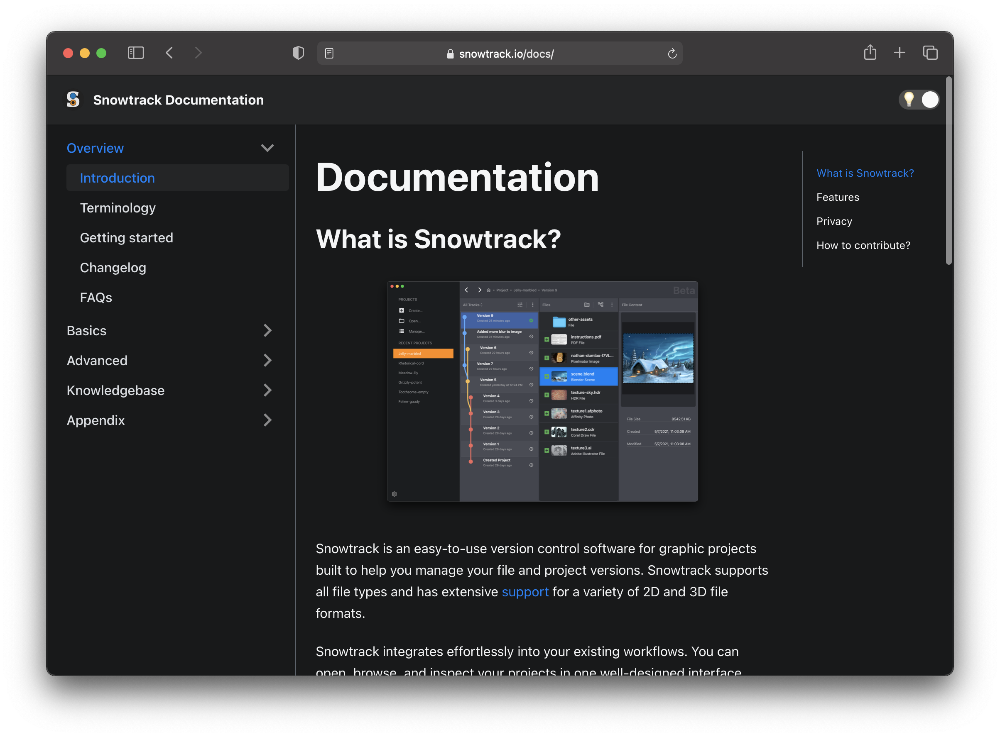

# Snowtrack Documentation



**Live:** [www.snowtrack.io/docs](https://www.snowtrack.io/docs)

This is the open-source repository of the documentation of Snowtrack. The documentation is built using [Docusaurus 2](https://v2.docusaurus.io/), a modern static website generator.

## Installation

```console
npm install
```

## Local Development

```console
npm start
```

This command starts a local development server and open up a browser window. Most changes are reflected live without having to restart the server. After executing the command above you reach the documentation at http://localhost:3000/docs

## Build

```console
npm build
```

This command generates static content into the `build` directory and can be served using any static contents hosting service.


## How to contribute?

The documentation is open-source and available under the [CC ShareAlike 4.0](https://creativecommons.org/licenses/by-sa/4.0/) license.
If you would like to contribute to this documentation, feel free to open an issue or pull-request on GitHub. Changes are automatically uploaded to [snowtrack.io/docs](https://www.snowtrack.io/docs) and are live within 10 minutes after approval of the pull-request.
